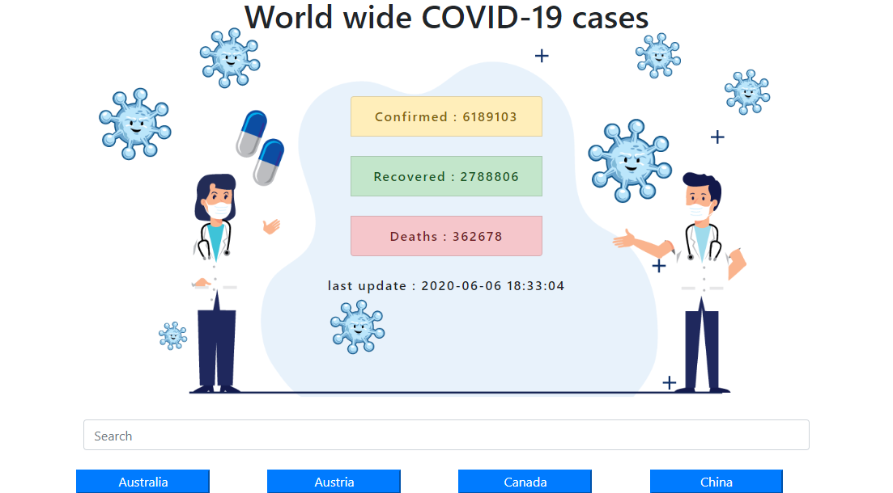
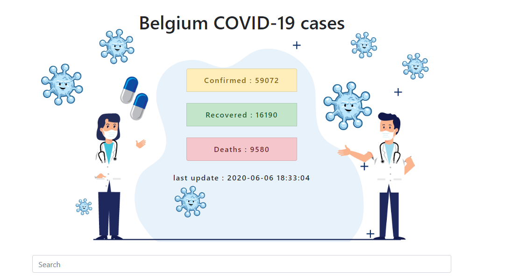

### BUILT WITH LARAVEL API AND JQuery

this is a simple project with laravel api and jquery, the main function is to get covid19 data from a csv file manipulate it, and fetched with jquery.

### screenshoots

### how to setup this repo on your machine

 1. `git clone THIS REPO URL`
 2.  cd into the folder and run `composer install`
 3. Install NPM Dependencies  `npm install` or yarn
 4. Create a copy of your .env file `cp .env.example .env`
 5. Generate an app encryption key `php artisan key:generate`
 6.  development server `php artisan serve`
		

### Data Source

https://github.com/CSSEGISandData/COVID-19
